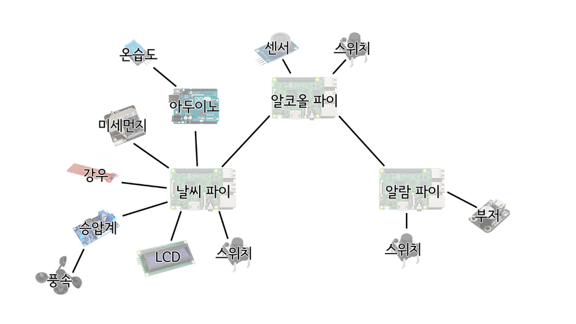
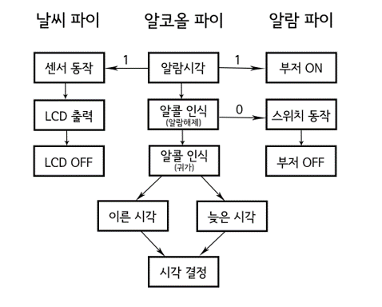

# 🌬 Breathe Deeply
>2020년 2학기 시스템 프로그래밍 및 실습 Term Project: Breathe deeply  

## :loudspeaker: 프로젝트 소개
알코올 센서를 통해 사용자의 음주 여부를 확인 후, 음주 여부에 따라 다음날 아침 맞춤 알람과 함께 날씨 정보를 제공해주는 시스템입니다.  

## 📆 개발기간
2020.11.06 ~ 2020.12.11  

## ⚙ HARDWARE


### 1. 알람 파이: 부저와 연결된 라즈베리파이  
* 라즈베리파이
* 스위치
* 부저   

### 2. 날씨 파이: 날씨 센서와 연결된 라즈베리파이
* 라즈베리파이
* 아두이노
* 승압계
* 온습도센서
* 미세먼지센서
* 강우센서
* 풍속센서
* 스위치
* LCD  

### 3. 알코올 파이: 알코올 센서와 연결된 라즈베리파이
* 라즈베리파이
* 알코올센서
* 스위치

<br/>

## 🔑 알고리즘 
  

사용자가 귀가 후 알코올 센서를 통해 바람을 불면, 알코올 농도를 측정하여 음주 여부를 판단합니다. 음주한 것으로 판단된다면, 다음날 대중교통을 이용하여 출근하여야 하는 것으로 판단하여 알람 설정 시각 중 이른 시각에 알람을 울리게 됩니다. 사용자가 음주 상태가 아니라고 판단되면, 다음날 자가용으로 출근할 수 있는 것으로 판단하여 알람 설정 시각 중 늦은 시각에 알람을 울리게 됩니다.  

### 1. 알람 파이
* 서버
* 알람 시각: 메시지 "1" 전송
* 알람 해제: 메시지 "0" 전송
* 알람 시각 외: 센서 입력 후 알람 시각 설정

### 2. 날씨 파이
* 클라이언트
* 서버로부터 "1" 수신 -> 센서 이용하여 값 측정, LCD에 출력
* 스위치를 이용하여 LCD 출력 조절

### 3. 알람 파이
* 클라이언트
* 서버로부터 "1" 수신 -> 부저 ON
* 서버로부터 "0" 수신 -> 스위치가 눌릴 떄까지 대기 후 부저 OFF

<br/>

## 🔨 Compile
### 1. 알람 파이
```$ gcc -o server server.c```  
```$ ./server [port1]```  
```$ ./server [port2]```  

### 2. 날씨 파이
Arduino code compile  
```$ make```  
```$ ./client [server ip addr.] [port1]```  

### 3. 알람 파이
```$ gcc -o alarm alarm.c```  
```$ ./alarm [server ip addr.] [port2]```